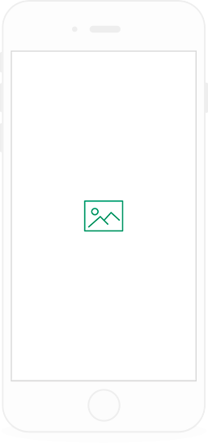
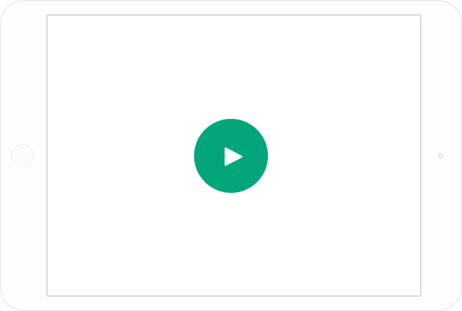

<!DOCTYPE html>
<html lang="ko">
<head>
  <meta charset="UTF-8">
  <meta name="viewport" content="width=device-width, initial-scale=1.0">
  <meta http-equiv="X-UA-Compatible" content="ie=edge">
  <title>Blokk</title>
  <link rel="stylesheet" type="text/css" href="style01.css">
  
</head>
<body>
<!-- wrapper 시작 -->
  

    <!-- header 시작 -->
    <header class="header">
      <!-- logo 시작 -->
      <h1 class="headerLogo"></h1>
      <!-- logo 종료 -->
      <!-- 메뉴 시작 -->
      <nav class="nav">
        <ul>
          <li class="navList"><a href="#">Stories</a></li>
          <li class="navList"><a href="#">Company</a></li>
          <li class="navList"><a href="#">About</a></li>
          <li class="navList"><a href="#">Contact</a></li>
        </ul>
      </nav>
      <!-- 메뉴 종료 -->
      <!-- log 시작 -->
      <form class="log">
        <input class="logIn" type="button" name="login" value="log in">
        <input class="signUp" type="button" name="signup" value="sign up">
      </form>
      <!-- log 종료 -->
    </header>
    <!-- header 종료 -->
    <!-- main 시작 -->
    <main class="main" >
      

        <h2 class="mainContentHeading">Blokk  Wireframe Kit</h2>
        
At half-past   eight the door opened, the policeman  appeared, and, requestingthem to follow him,  led the way to an adjoining hall.

        <!-- mian search 시작 -->
        <form class="mainSearch">
          <input class="mainSearchText" type="text" name="mainText"  placeholder="Input Field Text">
          <input class="mainSearchBtn" type="button" name="mainButton"  value="BUTTON">
        </form>
      

        <!-- mian search 종료 -->
        <!-- main image 시작 -->
        

      <!-- main image 종료 -->
    </main>
    <!-- main 종료 -->
    <!-- feature 시작 -->
    <section class="feature">
      <h2 class="featureHeading">Features</h2>
      
At half-past eight the door opened, the policeman appeared, and, requesting them to follow him, led the way to an adjoining hall.

      <!-- feature list 시작 -->
      <ul class="featureList">
        <li class="featureListItem">
          
          <h3>FIRST ONE</h3>
          
At half-past eight the door opened, the policeman appeared, and, requesting them to follow him.

        </li>
        <li class="featureListItem">
          
          <h3>SECOND ONE</h3>
          
At half-past eight the door opened, the policeman appeared, and, requesting them to follow him.

        </li>
        <li class="featureListItem">
          
          <h3>THIRD ONE</h3>
          
At half-past eight the door opened, the policeman appeared, and, requesting them to follow him.

        </li>
      </ul>
      <!-- feature list 종료 -->
    </section>
    <!-- feature 종료 -->
    <!-- video 시작 -->
    <section class="video">
      <h2 class="videoHeadig">Blokk Wireframe Kit</h2>
      <iframe width="524" height="390" id="videoIframe"
              src="https://www.youtube.com/embed/NEKXbemWev8" 
              frameborder="0" allowfullscreen></iframe>
      
    </section>
    <!-- video 종료 -->
    <!-- try now 시작 -->
    <section class="tryNow">
      <h2 class="tryNowHaeding">Try It Now</h2>
      
At half-past eight the door opened, the policeman appeared, and, requesting them to follow him, led the way to an adjoining hall. It was evidently a court-room.

      <input class="tryNowBtnColor" type="button" name="button" value="BUTTON">
      <input class="tryNowBtn" type="button" name="button" value="BUTTON">
    </section>
    <!-- try now 종료 -->
    <!-- out clients 시작 -->
    <section class="outClients">
      <h2 class="outClientsHaeding">Our Clients</h2>
      
At half-past eight the door opened, the policeman appeared, and, requesting them to follow him, led the way to an adjoining hall.

      <ul class="outClientsList">
        <li class="outClientsListItem">
          
          
<strong>JOHN DOE</strong>

          
Professional

          
At half-past eight the door opened, the policeman appeared, and, requesting them to follow him.
</li>
        <li class="outClientsListItem">
          
          
<strong>JOHN DOE</strong>

          
Professional

          
At half-past eight the door opened, the policeman appeared, and, requesting them to follow him.
</li>
        <li class="outClientsListItem">
          
          
<strong>JOHN DOE</strong>

          
Professional

          
At half-past eight the door opened, the policeman appeared, and, requesting them to follow him.
</li>
      </ul>
    </section>
    <!-- out clients 종료 -->
    <!-- footer 시작 -->
    <footer class="footer">
      <smaill class="smaill">Blokk UI Kit.</smaill>
      <ul class="footerNav">
        <li class="footerNavItem"><a href="#">Stories</a></li>
        <li class="footerNavItem"><a href="#">Company</a></li>
        <li class="footerNavItem"><a href="#">About</a></li>
        <li class="footerNavItem"><a href="#">Contact</a></li>
      </ul>
      <ul class="footerSocialIcon">
        <li class="footerSocialIconItem"></li>
        <li class="footerSocialIconItem"></li>
        <li class="footerSocialIconItem"></li>
        <li class="footerSocialIconItem"></li>
      </ul>
    </footer>
    <!-- footer 종료 -->
  

<!-- wrapper 종료 -->
</body>
</html>